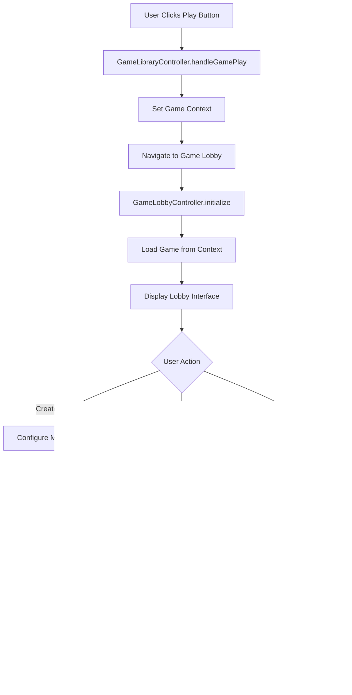

# 🎮 OMG Platform - Game Launch Process

## Table of Contents
- [Overview](#overview)
- [Architecture](#architecture)
- [Game Launch Flow](#game-launch-flow)
- [Detailed Process](#detailed-process)
- [Game Lobby System](#game-lobby-system)
- [Technical Implementation](#technical-implementation)
- [Code Examples](#code-examples)
- [Error Handling](#error-handling)
- [Future Enhancements](#future-enhancements)

---

## Overview

The OMG Platform implements a sophisticated game launching system that provides users with a seamless experience from game selection to actual gameplay. The system includes a game lobby that serves as an intermediate step between game selection and game execution, allowing users to configure match settings, join existing games, or create new matches.

### Key Components
- **Game Library**: Where users browse and select games
- **Game Lobby**: Where users configure match settings and join/create games
- **Game Manager**: Handles game launching and lifecycle management
- **Game Context**: Passes game information between screens
- **Screen Manager**: Manages navigation between different screens

---

## Architecture

```
┌─────────────────────────────────────────────────────────────────┐
│                        OMG Platform                            │
├─────────────────────────────────────────────────────────────────┤
│  ┌─────────────┐    ┌─────────────┐    ┌─────────────┐        │
│  │   Game      │    │   Game      │    │   Game      │        │
│  │  Library    │───▶│   Lobby     │───▶│  Manager    │        │
│  │             │    │             │    │             │        │
│  └─────────────┘    └─────────────┘    └─────────────┘        │
│         │                   │                   │              │
│         ▼                   ▼                   ▼              │
│  ┌─────────────┐    ┌─────────────┐    ┌─────────────┐        │
│  │ GameContext │    │ ScreenMgr   │    │ GameModule  │        │
│  │             │    │             │    │             │        │
│  └─────────────┘    └─────────────┘    └─────────────┘        │
└─────────────────────────────────────────────────────────────────┘
```

---

## Game Launch Flow

### Complete Flow Diagram



### Step-by-Step Process

1. **User Interaction** → User clicks "Play" button in Game Library
2. **Context Setup** → Game information is stored in GameContext
3. **Navigation** → User is taken to Game Lobby screen
4. **Configuration** → User configures match settings or selects existing match
5. **Validation** → Game settings are validated against game requirements
6. **Launch** → Game is launched with specified configuration
7. **Display** → Game interface is displayed to user

---

## Detailed Process

### 1. 🖱️ User Interaction Phase

#### Game Library Display
```java
// GameLibraryController.java
public class GameLibraryController {
    private GameManager gameLauncher;
    private ObservableList<GameModule> allGames;
    
    @FXML
    public void initialize() {
        // Initialize game services
        gameLauncher = GameManager.getInstance();
        
        // Load all available games
        List<GameModule> games = gameLauncher.getAllGames();
        allGames = FXCollections.observableArrayList(games);
        
        // Display games in UI
        updateGameDisplay();
    }
}
```

#### User Clicks "Play" Button
```java
private void handleGamePlay(GameModule game) {
    Logging.info("🎮 Play button clicked for game: " + game.getGameName());
    
    try {
        // Set the game context before navigating
        GameContext.getInstance().setCurrentGame(game);
        
        // Navigate to the game lobby instead of directly launching
        if (viewModel != null) {
            viewModel.navigateToGameLobby(game.getGameId());
            Logging.info("✅ Navigated to game lobby for: " + game.getGameName());
        } else {
            Logging.error("❌ ViewModel is null, cannot navigate to lobby");
        }
        
    } catch (Exception e) {
        Logging.error("❌ Error navigating to game lobby: " + e.getMessage(), e);
    }
}
```

### 2. 🎯 Game Context Management

#### GameContext Class
```java
public class GameContext {
    private static GameContext instance;
    private GameModule currentGame;
    
    public static GameContext getInstance() {
        if (instance == null) {
            instance = new GameContext();
        }
        return instance;
    }
    
    public void setCurrentGame(GameModule game) {
        this.currentGame = game;
    }
    
    public GameModule getCurrentGame() {
        return currentGame;
    }
}
```

### 3. 🎮 Game Lobby Phase

#### Lobby Initialization
```java
@Override
public void initialize(URL location, ResourceBundle resources) {
    Logging.info("🎮 Initializing GameLobbyController");
    
    // Initialize dependencies
    gameManager = GameManager.getInstance();
    
    // Set up UI components
    setupUI();
    setupEventHandlers();
    setupBindings();
    
    // Load game from context
    loadGameFromContext();
    
    Logging.info("✅ GameLobbyController initialized successfully");
}

private void loadGameFromContext() {
    GameContext context = GameContext.getInstance();
    if (context.hasCurrentGame()) {
        GameModule game = context.getCurrentGame();
        setCurrentGame(game);
        Logging.info("✅ Loaded game from context: " + game.getGameName());
    } else {
        Logging.warning("⚠️ No game found in context, lobby will be empty");
    }
}
```

#### Match Creation
```java
private void createMatch() {
    if (currentGame == null) {
        Logging.error("No current game set for match creation");
        return;
    }
    
    try {
        // Get match configuration
        String matchName = matchNameField.getText();
        GameMode gameMode = gameModeComboBox.getValue();
        int playerCount = playerCountSpinner.getValue();
        boolean isPrivate = privateMatchCheckBox.isSelected();
        int timeLimit = timeLimitSpinner.getValue();
        String difficulty = difficultyComboBox.getValue();
        
        // Create game options
        GameOptions gameOptions = new GameOptions();
        gameOptions.setOption("matchName", matchName);
        gameOptions.setOption("timeLimit", timeLimit);
        gameOptions.setOption("difficulty", difficulty);
        gameOptions.setOption("isPrivate", isPrivate);
        
        Logging.info("Creating match: " + matchName + " with " + playerCount + 
                    " players, mode: " + gameMode.getDisplayName());
        
        // Launch the game
        boolean success = gameManager.launchGameIntegrated(
            currentGame.getGameId(),
            gameMode,
            playerCount,
            gameOptions
        );
        
        if (success) {
            Logging.info("✅ Match created and game launched successfully");
        } else {
            Logging.error("❌ Failed to create match");
            showErrorDialog("Failed to create match");
        }
        
    } catch (Exception e) {
        Logging.error("Error creating match: " + e.getMessage(), e);
        showErrorDialog("Error creating match: " + e.getMessage());
    }
}
```

### 4. 🎯 GameManager Processing Phase

#### Game Validation
```java
public boolean launchGameIntegrated(String gameId, GameMode gameMode, 
                                  int playerCount, GameOptions gameOptions) {
    
    Logging.info("🚀 Launching integrated game: " + gameId + 
                " with mode: " + gameMode.getDisplayName());
    
    // 1. VALIDATION: Check if game is registered
    GameModule game = getGame(gameId);
    if (game == null) {
        Logging.error("❌ Game not found: " + gameId);
        return false;
    }
    
    // 2. VALIDATION: Check player count
    if (playerCount < game.getMinPlayers() || playerCount > game.getMaxPlayers()) {
        Logging.error("❌ Invalid player count: " + playerCount + " for game: " + gameId);
        return false;
    }
    
    // 3. VALIDATION: Check game mode support
    if (!isGameModeSupported(game, gameMode)) {
        Logging.error("❌ Game mode not supported: " + gameMode.getDisplayName() + 
                     " for game: " + gameId);
        return false;
    }
    
    // 4. LIFECYCLE: Close current game if any
    closeCurrentGame();
    
    // 5. LAUNCH: Call appropriate launch method
    return launchGameBasedOnType(game, gameMode, playerCount, gameOptions);
}
```

#### Game Mode Support Check
```java
private boolean isGameModeSupported(GameModule game, GameMode gameMode) {
    switch (gameMode) {
        case SINGLE_PLAYER:
            return game.supportsSinglePlayer();
        case LOCAL_MULTIPLAYER:
            return game.supportsLocalMultiplayer();
        case ONLINE_MULTIPLAYER:
            return game.supportsOnlineMultiplayer();
        default:
            return false;
    }
}
```

### 5. 🎨 Screen Management Integration

#### ScreenManager Navigation
```java
private boolean launchGameBasedOnType(GameModule game, GameMode gameMode, 
                                    int playerCount, GameOptions gameOptions) {
    
    // Get the main app's ScreenManager
    com.core.screens.ScreenManager screenManager = 
        com.core.screens.ScreenManager.getInstance();
    
    // Navigate to the game using the main app's screen system
    Object controller = screenManager.navigateToGame(
        game.getGameFxmlPath(),      // e.g., "/games/tictactoe/fxml/tictactoe.fxml"
        game.getGameCssPath(),       // e.g., "/games/tictactoe/css/tictactoe.css"
        game.getGameName() + " - " + gameMode.getDisplayName()  // Window title
    );
    
    if (controller != null) {
        // Store current game info
        currentGame = game;
        currentGameStage = screenManager.getMainStage();
        
        // Initialize the game controller with parameters
        initializeGameController(controller, gameMode, playerCount, gameOptions);
        
        Logging.info("✅ Game launched successfully: " + game.getGameName());
        return true;
    } else {
        Logging.error("❌ Failed to get controller from game navigation");
        return false;
    }
}
```

#### Controller Initialization
```java
private void initializeGameController(Object controller, GameMode gameMode, 
                                    int playerCount, GameOptions gameOptions) {
    try {
        // Use reflection to call the initializeGame method if it exists
        java.lang.reflect.Method initMethod = controller.getClass().getMethod(
            "initializeGame", 
            GameMode.class, 
            int.class, 
            GameOptions.class
        );
        
        if (initMethod != null) {
            initMethod.invoke(controller, gameMode, playerCount, gameOptions);
            Logging.info("✅ Game controller initialized with parameters");
        }
    } catch (NoSuchMethodException e) {
        Logging.info("ℹ️ Game controller doesn't have initializeGame method, skipping initialization");
    } catch (Exception e) {
        Logging.error("❌ Error initializing game controller: " + e.getMessage(), e);
    }
}
```

### 6. 🎮 Game Module Execution

#### Module's launchGame Method (Alternative Path)
```java
@Override
public Scene launchGame(Stage primaryStage, GameMode gameMode, 
                      int playerCount, GameOptions gameOptions) {
    
    Logging.info("🎮 Launching " + getGameName() + " with mode: " + 
                gameMode.getDisplayName() + ", players: " + playerCount);
    
    try {
        // 1. LOAD FXML: Load the game's UI layout
        String fxmlPath = getGameFxmlPath();
        Logging.info("📄 Loading FXML from: " + fxmlPath);
        
        FXMLLoader loader = new FXMLLoader(getClass().getResource(fxmlPath));
        
        // 2. CREATE SCENE: Create the JavaFX scene
        Scene scene = new Scene(loader.load());
        
        // 3. APPLY CSS: Apply styling if available
        String cssPath = getGameCssPath();
        if (cssPath != null && !cssPath.isEmpty()) {
            try {
                String cssUrl = getClass().getResource(cssPath).toExternalForm();
                scene.getStylesheets().add(cssUrl);
                Logging.info("🎨 Applied CSS: " + cssUrl);
            } catch (Exception e) {
                Logging.warning("⚠️ Could not load CSS: " + cssPath + " - " + e.getMessage());
            }
        }
        
        // 4. INITIALIZE CONTROLLER: Set up the game controller
        Object controller = loader.getController();
        if (controller != null) {
            if (controller instanceof TicTacToeController) {
                TicTacToeController ticTacToeController = (TicTacToeController) controller;
                ticTacToeController.initializeGame(gameMode, playerCount, gameOptions);
            }
        } else {
            Logging.error("❌ Controller is null for " + getGameName());
        }
        
        Logging.info("✅ " + getGameName() + " launched successfully");
        return scene;
        
    } catch (Exception e) {
        Logging.error("❌ Failed to launch " + getGameName() + ": " + e.getMessage(), e);
        return null;
    }
}
```

### 7. 🎯 Game Controller Setup

#### Controller Initialization
```java
public class TicTacToeController implements Initializable {
    
    // Game state variables
    private GameMode gameMode;
    private int playerCount;
    private GameOptions gameOptions;
    private TicTacToeGame game;
    
    @Override
    public void initialize(URL location, ResourceBundle resources) {
        // Basic UI setup
        setupUI();
        setupEventHandlers();
    }
    
    public void initializeGame(GameMode gameMode, int playerCount, GameOptions gameOptions) {
        this.gameMode = gameMode;
        this.playerCount = playerCount;
        this.gameOptions = gameOptions;
        
        Logging.info("🎯 Initializing TicTacToe game with " + playerCount + 
                    " players, mode: " + gameMode.getDisplayName());
        
        // Apply game-specific options
        if (gameOptions != null) {
            int timeLimit = gameOptions.getIntOption("timeLimit", 30);
            timeRemaining = timeLimit;
            updateTimerDisplay();
        }
        
        // Start the game
        startNewGame();
    }
    
    private void startNewGame() {
        // Create game logic instance
        game = new TicTacToeGame(playerCount, gameOptions);
        
        // Initialize players
        initializePlayers();
        
        // Set up game board
        setupGameBoard();
        
        // Update UI
        updateUI();
        
        Logging.info("🎮 New TicTacToe game started");
    }
}
```

### 8. 🎨 UI Display Phase

#### Scene Display
```java
public Object navigateToGame(String fxmlPath, String cssPath, String title) {
    try {
        // Load FXML
        FXMLLoader loader = new FXMLLoader(getClass().getResource(fxmlPath));
        Scene scene = new Scene(loader.load());
        
        // Apply CSS
        if (cssPath != null && !cssPath.isEmpty()) {
            String cssUrl = getClass().getResource(cssPath).toExternalForm();
            scene.getStylesheets().add(cssUrl);
        }
        
        // Set scene on main stage
        Stage mainStage = getMainStage();
        mainStage.setScene(scene);
        mainStage.setTitle(title);
        mainStage.setResizable(false);
        
        // Return controller for further initialization
        return loader.getController();
        
    } catch (Exception e) {
        Logging.error("Error navigating to game: " + e.getMessage(), e);
        return null;
    }
}
```

---

## Game Lobby System

### Overview
The Game Lobby serves as the main interface between game selection and actual gameplay. It provides users with comprehensive match configuration options and the ability to join existing games.

### Key Features

#### 1. Match Creation Panel
- **Game Mode Selection**: Single Player, Local Multiplayer, Online Multiplayer
- **Player Count Configuration**: Adjustable based on game limits
- **Match Naming**: Custom match names
- **Privacy Settings**: Public or private matches
- **Time Limits**: Configurable game duration
- **Difficulty Levels**: Easy, Medium, Hard options

#### 2. Available Matches Display
- **Match List**: Shows all available matches with details
- **Match Information**: Host, game mode, player count, privacy status
- **Join Functionality**: Click to join existing matches
- **Real-time Updates**: Refresh capability for match list

#### 3. Quick Play Option
- **One-click Start**: Launch with default settings
- **Automatic Configuration**: Uses game's minimum requirements
- **Fast Entry**: Bypass detailed configuration

### Lobby Interface Layout

```
┌─────────────────────────────────────────────────────────────────┐
│                        Game Lobby                               │
├─────────────────────────────────────────────────────────────────┤
│  ┌─────────────────────┐    ┌─────────────────────────────┐    │
│  │   Game Information  │    │     Available Matches       │    │
│  │                     │    │                             │    │
│  │  🎮 Game Icon       │    │  📋 Match List              │    │
│  │  📝 Game Name       │    │  • Cool Match (2/4)         │    │
│  │  📄 Description     │    │  • Epic Battle (3/6) 🔒     │    │
│  │                     │    │  • Quick Game (1/2)         │    │
│  └─────────────────────┘    └─────────────────────────────┘    │
│                              │                             │    │
│  ┌─────────────────────┐    │  ┌─────────────────────────┐│    │
│  │   Create Match      │    │  │    Match Information    ││    │
│  │                     │    │  │                         ││    │
│  │  🎯 Game Mode       │    │  │  Select a match from    ││    │
│  │  👥 Player Count    │    │  │  the list above to see  ││    │
│  │  📝 Match Name      │    │  │  details                ││    │
│  │  🔒 Private Match   │    │  │                         ││    │
│  │  ⏱️ Time Limit      │    │  └─────────────────────────┘│    │
│  │  🎯 Difficulty      │    │                             │    │
│  │                     │    └─────────────────────────────┘    │
│  │  [Create Match]     │                                       │
│  │  [Quick Play]       │                                       │
│  └─────────────────────┘                                       │
└─────────────────────────────────────────────────────────────────┘
```

---

## Technical Implementation

### Key Classes and Their Roles

#### 1. GameLobbyController
- **Purpose**: Main controller for the lobby interface
- **Responsibilities**: 
  - Handle user interactions
  - Manage match creation and joining
  - Coordinate with GameManager for game launching
  - Update UI based on game context

#### 2. GameContext
- **Purpose**: Singleton class for passing game data between screens
- **Responsibilities**:
  - Store current game information
  - Provide access to game data across different controllers
  - Manage game state during navigation

#### 3. GameManager
- **Purpose**: Central game management and launching
- **Responsibilities**:
  - Validate game settings
  - Handle game lifecycle
  - Coordinate with ScreenManager for navigation
  - Manage game state and resources

#### 4. ScreenManager
- **Purpose**: Handle navigation between different screens
- **Responsibilities**:
  - Load FXML files and CSS
  - Manage scene transitions
  - Handle controller initialization
  - Maintain screen state

### Data Flow

```
Game Library → Game Context → Game Lobby → Game Manager → Game Module
     ↓              ↓              ↓              ↓              ↓
User clicks    Store game    Configure     Validate &     Launch game
Play button    information   match         launch         with settings
```

---

## Code Examples

### Complete Game Launch Example

```java
// 1. User clicks play button in Game Library
private void handleGamePlay(GameModule game) {
    // Set game context
    GameContext.getInstance().setCurrentGame(game);
    
    // Navigate to lobby
    viewModel.navigateToGameLobby(game.getGameId());
}

// 2. Lobby loads game from context
private void loadGameFromContext() {
    GameContext context = GameContext.getInstance();
    if (context.hasCurrentGame()) {
        GameModule game = context.getCurrentGame();
        setCurrentGame(game);
        updateGameInfo();
        loadAvailableMatches();
    }
}

// 3. User creates match in lobby
private void createMatch() {
    // Get configuration from UI
    GameMode gameMode = gameModeComboBox.getValue();
    int playerCount = playerCountSpinner.getValue();
    GameOptions gameOptions = createGameOptions();
    
    // Launch game
    boolean success = gameManager.launchGameIntegrated(
        currentGame.getGameId(),
        gameMode,
        playerCount,
        gameOptions
    );
}

// 4. GameManager validates and launches
public boolean launchGameIntegrated(String gameId, GameMode gameMode, 
                                  int playerCount, GameOptions gameOptions) {
    // Validate game exists
    GameModule game = getGame(gameId);
    if (game == null) return false;
    
    // Validate player count
    if (playerCount < game.getMinPlayers() || playerCount > game.getMaxPlayers()) {
        return false;
    }
    
    // Validate game mode
    if (!isGameModeSupported(game, gameMode)) return false;
    
    // Close current game
    closeCurrentGame();
    
    // Launch new game
    return launchGameBasedOnType(game, gameMode, playerCount, gameOptions);
}
```

---

## Error Handling

### Comprehensive Error Management

#### 1. Validation Errors
```java
// Game not found
if (game == null) {
    Logging.error("❌ Game not found: " + gameId);
    return false;
}

// Invalid player count
if (playerCount < game.getMinPlayers() || playerCount > game.getMaxPlayers()) {
    Logging.error("❌ Invalid player count: " + playerCount + " for game: " + gameId);
    return false;
}

// Unsupported game mode
if (!isGameModeSupported(game, gameMode)) {
    Logging.error("❌ Game mode not supported: " + gameMode.getDisplayName());
    return false;
}
```

#### 2. Resource Loading Errors
```java
try {
    FXMLLoader loader = new FXMLLoader(getClass().getResource(fxmlPath));
    Scene scene = new Scene(loader.load());
} catch (Exception e) {
    Logging.error("❌ Failed to load FXML: " + e.getMessage(), e);
    return null;
}
```

#### 3. User Feedback
```java
private void showErrorDialog(String message) {
    Alert alert = new Alert(Alert.AlertType.ERROR);
    alert.setTitle("Error");
    alert.setHeaderText(null);
    alert.setContentText(message);
    alert.showAndWait();
}
```

### Error Recovery Strategies

1. **Graceful Degradation**: Fall back to default settings if configuration fails
2. **User Notification**: Clear error messages with actionable information
3. **Logging**: Comprehensive logging for debugging and monitoring
4. **State Recovery**: Maintain application state during errors

---

## Future Enhancements

### Planned Features

#### 1. Real-time Match Discovery
- **WebSocket Integration**: Live updates of available matches
- **Match Filtering**: Search and filter matches by criteria
- **Player Status**: Show online/offline status of players

#### 2. Advanced Match Management
- **Tournament Support**: Organize and join tournaments
- **Spectator Mode**: Watch games without participating
- **Replay System**: Review previous games

#### 3. Enhanced User Experience
- **Match History**: Track previous games and results
- **Player Profiles**: Detailed player statistics and achievements
- **Social Features**: Friend lists and invitations

#### 4. Performance Optimizations
- **Lazy Loading**: Load game resources on demand
- **Caching**: Cache frequently used game data
- **Background Processing**: Handle heavy operations asynchronously

### Technical Roadmap

#### Phase 1: Core Lobby System ✅
- Basic match creation and joining
- Game configuration options
- Navigation between screens

#### Phase 2: Real-time Features
- WebSocket integration for live updates
- Match filtering and search
- Player status indicators

#### Phase 3: Advanced Features
- Tournament system
- Spectator mode
- Replay functionality

#### Phase 4: Performance & Polish
- Performance optimizations
- Enhanced UI/UX
- Mobile responsiveness

---

## Conclusion

The OMG Platform's game launch system provides a robust, user-friendly experience that bridges the gap between game selection and actual gameplay. The game lobby serves as a crucial intermediate step that allows users to configure their gaming experience while providing a foundation for future multiplayer features.

The system is designed with scalability and extensibility in mind, making it easy to add new features and support additional game types. The comprehensive error handling and logging ensure a stable user experience while providing developers with the tools needed for debugging and monitoring.

With the current implementation, users can:
- Browse and select games from the library
- Configure detailed match settings in the lobby
- Join existing matches or create new ones
- Launch games with custom configurations
- Navigate seamlessly between different screens

The foundation is now in place for building a comprehensive multiplayer gaming platform with advanced features like real-time match discovery, tournaments, and social gaming features. 